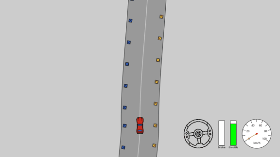

# Model-Based Trajectory Planning and Residual Reinforcement Learning Control

<p align="center">
  
</p>

<p align="center">
  
  
  
  
  
  
  
  
  
</p>

## Description

`main` ships a `SectorResidualAgent`: a minimum-curvature racing line, sector-scheduled
classical control, and a residual policy trained with Soft Actor-Critic (SAC) riding on
top for the corrections geometry alone can't reach. Measured return on the fixed
evaluation track is **97.94** (10-episode eval, std ~1e-6 - the track is deterministic),
against a baseline pass mark of 62-64

The path here, in order:

1. **Pure pursuit** - the "learn to walk" phase. No learning at all, actually: a
   classical geometric tracker straight out of a 1980s Carnegie Mellon paper, chasing a
   lookahead point on the centerline and throttling off a speed profile. Ten gains, hand
   nothing, tuned by random search seeding a `(mu, lambda)`-evolution strategy until the
   car stopped embarrassing itself. Zero neural nets, Yet, **83.76**.
2. **Residual SAC on the centerline tracker** - An off-policy actor-critic bolted on
    top of (1) to nudge apex bias, speed and steering, rather than being trusted with the
    pedals from scratch. Left alone, it collapses spectacularly within 4k steps,
    the untrained critic yanks a zero-initialized actor straight off the controller and
    the car forgets how to drive. The fix is a quadratic leash: a penalty on residual
    magnitude that decays to zero over training, so the policy stays on a short lead
    early and gets let off once the critic actually knows
   something. **90.76**, and honestly a bit underwhelming, because no residual can
   out-drive a bad choice of racing line.
3. **Minimum-curvature racing line** - the "stop driving like a student driver" phase.
   Following the centerline is safe and slow; a corridor-constrained curvature
   minimization solve produces an actual racing line, hugging the inside of corners the
   way anyone who has played a kart game intuitively knows is correct. Tracked by a
   re-tuned pure-pursuit-style controller.  **92.24**.
4. **Sector-wise control policy** -
   The line is fixed, but the car should not drive every corner the same way. A
   34-parameter sector controller carves the lap into sectors with their own speed
   scale and braking limit, adds launch handling off the line, a first-order steering
   filter, and a curvature-scheduled lookahead, all tuned by ES and seeded from the
   previous best so the search is a ratchet, never a regression. An ablation confirms
   per-sector speed scaling is doing the heavy lifting; the rest sit inside search noise
   but earn their keep as harmless. No RL. **96.89**.
5. **Residual SAC on the sector controller** - the "final polish from a coach with a
   stopwatch" phase. Same trick as step 2, now standing on a much better shoulder: a
   compact feature vector (slip flags, measured acceleration margins against tire-limit
   references, curvature ahead at eight stations, speed error against the profile)
   deliberately hides the cross-track error, so the policy can't cheese its way to a
   higher score by just becoming a slightly better tracker of a line that is already
   tracked well - it has to go find genuine margin the classical controller left on the
   table. **97.94**, shipped on `main`.

## Setup

```bash
git clone https://github.com/Aravindan-Madan-Kumar/RL-Challenge.git
cd RL_Challenge
pixi install --frozen   # reproduces pixi.lock 
pixi shell
```

Verify the environment and the artifact both work:

```bash
python try_agent.py     # loads models/model.obj, runs 10 eval episodes
```

Expected output ends with something close to:

```
Mean return: 97.93656456126675
Std. deviation: 7.41e-07
```

## Running the evaluation yourself

`try_agent.py` *is* the evaluation harness - it imports `agent_interface.py`, loads
`models/model.obj` through `util.load_model`, and runs the same 10-episode rollout the
grader runs on push to `main`. No separate eval script exists or is needed:

```bash
pixi run python try_agent.py
```

To inspect training instead of just the shipped checkpoint, `training.py` and the
per-agent scripts under `pure_pursuit/`, `raceline/`, and `residual_sac/` are all
free-form and not executed at grading time - they document how `models/model.obj` was
produced.

## Driving it yourself

The environment ships a manual keyboard-driven mode, useful for sanity-checking physics
and getting a feel for the car before reading any of the controller code:

```bash
pixi run python run_human.py
```

Arrow keys steer and throttle/brake. This is unrelated to grading - it's the same
`CarEnv/` the trained agents drive, just with a human in the loop instead of
`agent_interface.Agent.get_action`.

## Building your own agent and obtaining `model.obj`

Nothing here is sacred - fork it, rip out whatever step you don't like, and produce your
own checkpoint. The general shape every agent in this repo follows:

1. **Write your controller or policy somewhere other than `agent_interface.py`.** Keep
   training-only code (data logging, replay buffers, optimizers, wandb) out of that
   file entirely - it's the one file the grader imports, and it must import nothing
   outside `pixi.toml`/`pixi.lock`. `raceline/`, `pure_pursuit/`, and `residual_sac/`
   are the existing examples of "a package that does the real work."

2. **Add a thin `Agent`-shaped class to `agent_interface.py`.** It needs a `get_action`
   method with that exact name and signature, and nothing else about its shape is
   fixed - subclass `torch.nn.Module` (as every agent here does, so `util.save_model`
   knows to move it to CPU) or don't, as long as the object survives a pickle
   round-trip. Define the class *in* `agent_interface.py` itself, not just import it
   from your package - pickle records a class's defining module, and the grader only
   ever imports `agent_interface`, so a class merely imported there unpickles fine
   locally and dies on the grader. If your policy is a neural net, store its weights as
   a plain state dict and rebuild the network lazily in a method (see
   `SectorResidualAgent.actor()`), rather than pickling the `nn.Module` subclass
   directly - it keeps CUDA tensors from ever entering the artifact.

3. **Train it, however you like, in `training.py` or your own package's scripts.**
   Free-form, not executed at grading time. `residual_sac/scripts/train_sector.py` is
   the fullest example - CleanRL-style SAC with a replay buffer, target networks and
   periodic checkpointing:

   ```bash
   pixi run python residual_sac/scripts/train_sector.py \
       --seed 0 --total-timesteps 700000 --out-dir runs_sector
   ```

4. **Write a small install script that builds your agent, scores it, and only then
   overwrites `models/model.obj`.** `raceline/scripts/install.py` is the template:
   it builds the candidate, runs a few evaluation episodes through the exact
   `convert_obs -> get_action -> convert_action` path the grader uses, refuses to
   overwrite the current artifact unless the new one scores higher, and after saving,
   unpickles the result in a clean subprocess (`cwd='/'`, only the repo root on
   `sys.path`) to catch the "works locally, dies on the grader" class of bug before it
   ships:

   ```bash
   pixi run python raceline/scripts/install.py --agent sector --save
   ```

   For a checkpoint produced by a training run rather than a closed-form solve,
   `residual_sac/scripts/harvest.py` does the equivalent job - point it at your run
   directory and let it pick and install the best checkpoint:

   ```bash
   pixi run python residual_sac/scripts/harvest.py \
       --pattern 'runs_sector/seed*/best.obj' --save
   ```

5. **Verify with the actual grading harness, not your own scoring loop.**

   ```bash
   pixi run python try_agent.py
   ```

   If this doesn't match the number your install script reported, something about the
   artifact differs from what the grader will see - stop and find out why before
   pushing.

## Repository layout

| Path | What it is |
| --- | --- |
| `agent_interface.py` | The only file the grader imports - `convert_obs`, `convert_action`, and every `Agent` class, including the shipped `SectorResidualAgent` |
| `models/model.obj` | The graded checkpoint, pickled via `util.save_model` |
| `pure_pursuit/` | Geometric controller and ES tuner |
| `raceline/` | Minimum-curvature solver, sector controller, ES tuners, CLAIX job scripts |
| `residual_sac/` | SAC residual policy, replay buffer, feature extractors, CLAIX job scripts |
| `CarEnv/` | The Box2D race environment |
| `try_agent.py` | Local eval harness |
| `run_human.py` | Manual keyboard driving |
